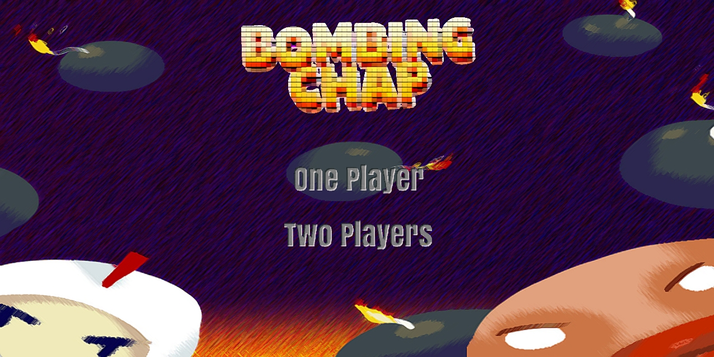

# Pygame Bomberman 🎮💣

*A classic Bomberman clone built with Pygame by a Python beginner, showcasing effective AI collaboration*

 
## How to download the game to your computer
- If you have the python environment, you can download the bomberman directory
- if you don't want to run it in a python environment, you can directly download the release.zip file and uncompress it to play it
  - if you can't play it
  - Try
    - Right-click the file
    - Properties → Check "Unblock"
    - Click "OK".

## Features ✨
- **Multiplayer Modes**: 1P vs AI or 2P local battles
- **6 Unique Maps**: Including random map generator
- **5 Playable Characters**: Each with distinct stats:
  - Bomberman (balanced)
  - Creep (long-range bombs)
  - Grass (fast movement)
  - Potato (multiple bombs)
  - Wizard (extreme speed)
- **Dynamic Game Systems**:
  - Bomb chain reactions
  - Screen shake effects
  - Destructible terrain with 25% powerup drops
  - Animated character deaths

## Development Highlights 🛠️
As a Python beginner, this project demonstrates how AI assisted with:
- **Architecture Design**: Clean separation of game states (menu/game)
- **Performance Optimization**: Consistent 60 FPS gameplay
- **Complex Systems**:
  - Bomb explosion propagation
  - Collision detection
  - Character animation blending
- **Debugging**: Resolving Pygame surface memory issues

## Project Structure 📂
    bomberman/
    ├── src/
    │   ├── main.py                # Entry point
    │   ├── game.py                # Main game loop (400+ LOC)
    │   ├── menu.py                # Interactive menu system (300+ LOC)
    │   ├── character.py           # Player/Enemy logic (300+ LOC)
    │   ├── bomb.py                # Bomb mechanics (200+ LOC)
    │   ├── map.py                 # Tile-based map system
    │   ├── animations.py          # Sprite animation controller
    │   ├── character_factory.py   # Character configuration
    │   ├── constants.py           # Game settings (maps, physics)
    └── assets/                    # Game resources


## Technical Details ⚙️
```python
# Sample bomb explosion calculation
def _calculate_explosion_range(self, game_map):
    """Dynamically calculates bomb blast radius"""
    center_x = self.rect.centerx // TILE_SIZE
    center_y = self.rect.centery // TILE_SIZE
    range_tiles = [(center_x, center_y)]
    
    for dx, dy in [(1,0), (-1,0), (0,1), (0,-1)]:
        for i in range(1, self.bomb_range + 1):
            x, y = center_x + dx*i, center_y + dy*i
            if not (0 <= y < len(map_data) and 0 <= x < len(map_data[0]):
                break
            if map_data[y][x] == 1: break  # Solid wall
            range_tiles.append((x, y))
            if map_data[y][x] == 2: break  # Breakable wall
    return range_tiles
```

## Installation & Play 🚀
```bash
git clone https://github.com/yourusername/pygame-bomberman
cd pygame-bomberman
pip install pygame
python main.py
```

## Controls 🕹️

| Player  | Movement      | Place Bomb |
|---------|---------------|------------|
| Player 1| `WASD`        | `SPACE`    |
| Player 2| Arrow Keys ↑↓←→ | `ENTER`    |

## AI Collaboration Insights 🤖

| Challenge          | AI Solutions                      |
|-----------|-----------------------------------|
| Animation blending      |Suggested AnimationController class with state management |
| Bomb collision   | Proposed recursive explosion algorithm                       |
| Resource loading      | Implemented resource_path() for cross-platform support      |
| Enemy     | AI	Developed weighted random movement system                    |
